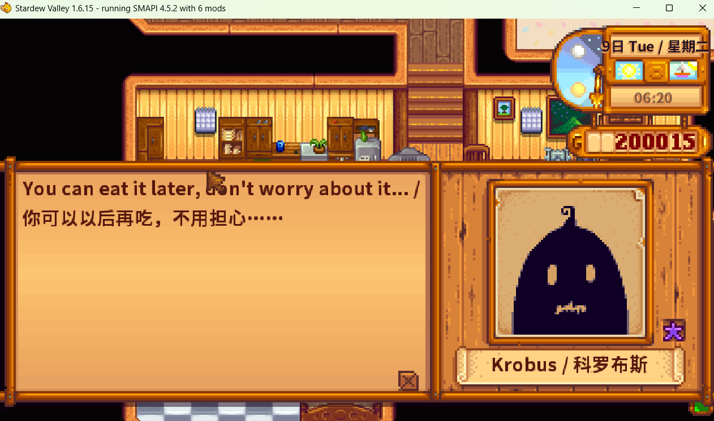
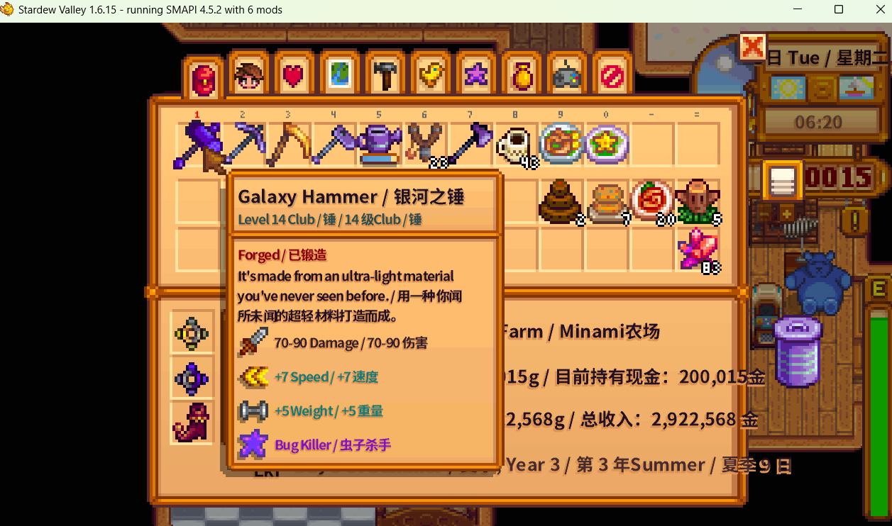
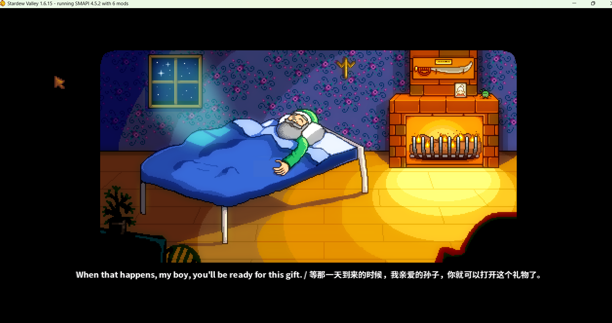
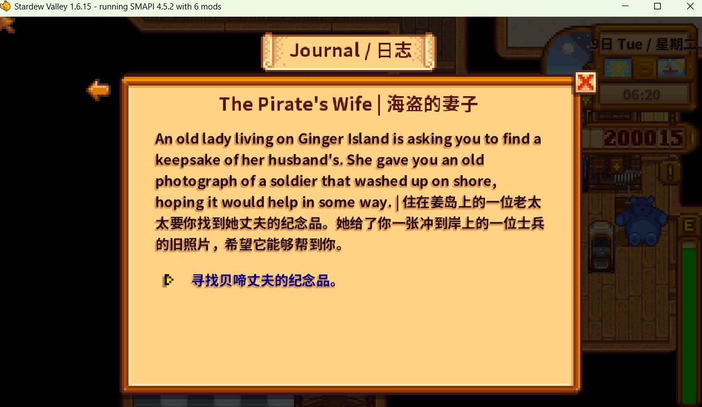
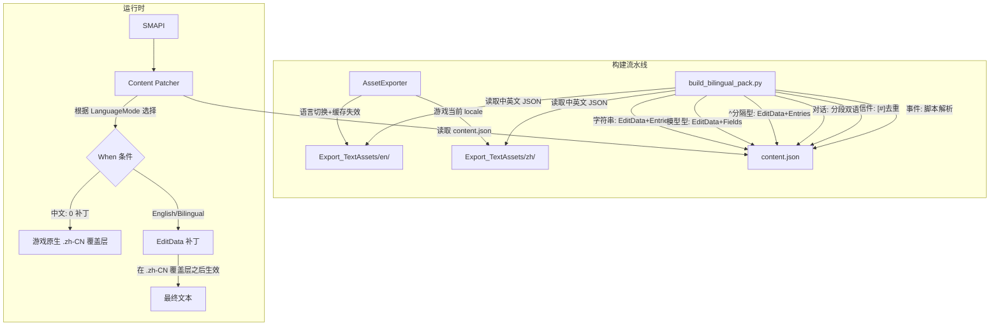
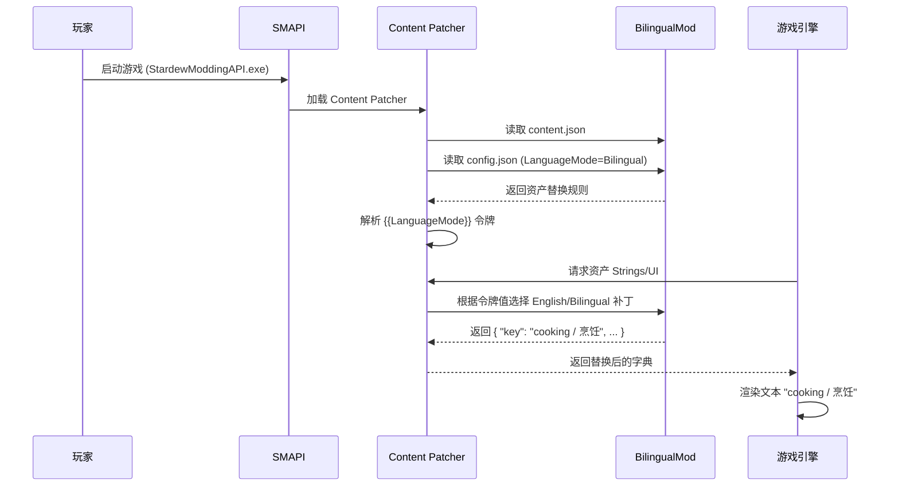

# Stardew Valley Bilingual Text

星露谷物语中英 / 德英 / 日中等多语言对双语同屏显示 Mod。
基于 Content Patcher 实现，**无需修改游戏代码**，支持实时切换显示模式。

所有界面文本、对话、事件、物品描述、信件、日历节日等均可显示为 `语言A / 语言B`，方便对照学习。

## 功能

- **语言对选择** — 在 GMCM 中选择 `en-zh`（英中）、`de-en`（德英）、`ja-zh`（日中）等
- **开启** — 选中语言对后，所有文本显示为 `语言A / 语言B`
- **关闭** — 跟随游戏语言设置，不进行任何干预

支持切换的场景：
- Strings/\* 界面文本（菜单、按钮、提示等）
- Characters/Dialogue/\* 所有 NPC 对话（含 $d/$p 条件语句、$y 快速问答、$q/$r Q&A、#$1 条件分支）
- Data/Events/\* 所有剧情事件（含 $q/$r 问答、$y 快速问答、#$b# 分段）
- Data/Objects, Data/Tools, Data/Weapons 等物品的名称和描述
- Data/Bundles, Data/Monsters, Data/hats, Data/Boots 等管道分隔型数据
- Data/NPCGiftTastes 所有 NPC 送礼反应（爱/喜欢/普通/讨厌/厌恶五档）
- Data/mail 信件（正文+标题）
- Data/Festivals/\* 日历节日名称 + 节日 NPC 对话 + 节日事件
- Data/SecretNotes, Data/Achievements 秘密纸条和成就
- Data/ExtraDialogue, Strings/MovieReactions, Strings/SpecialOrderStrings 对话文本
- Strings/schedules/\* NPC 日程文本

通过 Generic Mod Config Menu (GMCM) 在游戏中实时切换，**无需重启**立即生效。

## 效果截图

| 对话 | 背包物品 |
|:----:|:--------:|
|  |  |

| 开场动画 | 任务日志 |
|:--------:|:--------:|
|  |  |

## 前置要求

本 Mod 是一个 Content Patcher **内容包**（content pack），本身不含游戏修改逻辑。运行时需要以下组件：

| 组件 | 下载地址 | 说明 |
|------|---------|------|
| **Stardew Valley 1.6+** | Steam / GOG | 游戏本体，必须为 1.6 或更高版本（已包含官方中文语言包） |
| **SMAPI 4.0+** | [smapi.io](https://smapi.io/) | 模组加载器。将 Modding API 注入游戏，是运行所有 Mod 的基础 |
| **Content Patcher 2.0+** | [Nexus Mods](https://www.nexusmods.com/stardewvalley/mods/1915) | 数据包框架。本 Mod 通过它替换游戏文本，不修改任何游戏文件 |
| **GMCM 1.16+**（可选） | [Nexus Mods](https://www.nexusmods.com/stardewvalley/mods/5098) | 游戏内配置菜单。推荐安装以便在游戏中切换语言模式 |

> **安装顺序：** SMAPI → Content Patcher → GMCM（可选）→ 本 Mod

## 下载

从 [Releases](https://github.com/QingGo/stardew-biling-mod/releases) 页面下载最新版本的 `BilingualMod-v*.zip`。

## 安装

### 首次安装

1. 确保已安装上述所有前置依赖（SMAPI、Content Patcher）
2. 下载 `BilingualMod-v*.zip`（从本页面顶部 [Releases](https://github.com/QingGo/stardew-biling-mod/releases) 获取）
3. 解压 zip 文件，将 `BilingualMod` 文件夹**整体**放入 `Stardew Valley/Mods/` 目录下
   - 最终路径应为：`Stardew Valley/Mods/BilingualMod/content.json`
   - 如果放错了（例如多了一层文件夹），Mod 不会被识别
4. 通过 `StardewModdingAPI.exe` 启动游戏（不要用原版 Stardew Valley.exe）
5. 在标题画面将 **Language** 设为 **中文**
   - ⚠ **这一步必须做**，否则中文字体无法渲染，双语文字会显示为方框
6. 配置语言模式（二选一）：

   **方法一：在标题画面配置（推荐）**
   - 在主菜单（标题画面），点击左下角的 ⚙ **齿轮图标**（Mods 按钮）
   - 选择 `Stardew Valley Bilingual Text`
   - 找到 `BilingualMode`（默认已开启 `true`）
   - 如需中文模式，将其改为 `false`，点击 **保存并退出**，然后加载存档

   **方法二：进入游戏后配置**
   - 加载存档后，按 `ESC` 打开背包/暂停界面
   - 点击菜单栏右侧的 🎮 **游戏手柄图标**（Mods 按钮）
   - 向下滚动到底部，选择 `Stardew Valley Bilingual Text`
   - 将 `BilingualMode` 改为 `false` 即可关闭双语，改回 `true` 重新开启
   - 每次更改后点击 **保存并退出**

   > 默认模式为 **开启**（安装后即可看到双语效果）。也可以直接编辑 `Mods/BilingualMod/config.json` 文件，将 `"BilingualMode"` 设为 `"false"` 关闭双语。

### 更新版本

1. 下载最新 `BilingualMod-v*.zip`
2. **删除**旧版 `Stardew Valley/Mods/BilingualMod/` 整个文件夹
3. 解压新的 zip 到 `Stardew Valley/Mods/`，步骤与首次安装相同
4. 启动游戏即可

> ⚠ 不要直接覆盖旧文件，有时旧版的文件结构会和新版冲突。

## 当前覆盖情况

### 字符串资产（EditData + Entries，按条目替换）

| 类别 | 资产数 |
|------|--------|
| Strings/* 界面文本 | 30 |
| 对话 (Characters/Dialogue/* + ExtraDialogue + MovieReactions + SpecialOrderStrings + StringsFromCSFiles + 1_6_Strings + StringsFromMaps + SimpleNonVillagerDialogues) | 48 |
| 日程文本 (Strings/schedules/*) | 30 |
| Data 文本 (mail, TV/*, FestivalDates) | 4 |
| 事件对话 (Data/Events/*) | 43 |

### 结构型数据资产（EditData + Fields，按字段替换）

| 类别 | 方法 | 条目数 |
|------|------|--------|
| 一般物品 (Data/Objects) | Fields `DisplayName`+`Description` | 807 |
| 工具 (Data/Tools) | Fields | 37 |
| 武器 (Data/Weapons) | Fields | 67 |
| 大件可制造 (Data/BigCraftables) | Fields | 182 |
| 上衣 (Data/Shirts) | Fields | 303 |
| 裤子 (Data/Pants) | Fields | 18 |
| 帽子 (Data/hats) | Fields (数值索引 5,1) | 122 |
| 靴子 (Data/Boots) | Fields (数值索引 6,1) | 18 |
| 特殊能力 (Data/Powers) | Fields | 36 |
| 饰品 (Data/Trinkets) | Fields | 8 |
| 任务 (Data/Quests) | Fields (数值索引 1,2) | 66 |
| 订婚对话 (Data/EngagementDialogue) | Fields (数值索引 0,1) | 26 |
| Bundle (Data/Bundles) | Fields (数值索引 6) | 31 |
| 怪物 (Data/Monsters) | Fields (数值索引 14) | 51 |
| 送礼反应 (Data/NPCGiftTastes) | Fields (多字段 pipe_multi 索引 0,2,4,6,8) | 39 |

### `^` 分隔型数据资产（EditData + Entries，全值替换）

| 类别 | 条目数 |
|------|--------|
| 成就 (Data/Achievements) | 39 |
| 秘密纸条 (Data/SecretNotes) | 38 |

### 运行时补丁统计

| 模式 | 活跃补丁数 |
|------|-----------|
| BilingualMode = false（关闭） | 0（所有补丁通过 `When` 条件跳过，游戏原生文本） |
| BilingualMode = true（开启） | 193（160 字符串 + 25 Data Fields + 8 节日） |

### 日历节日（EditData + Entries，NPC 对话 + 事件脚本 + 节日名称）

| 节日 | 资产 | 条目数 |
|------|------|--------|
| 复活节 (Egg Festival) | `Data/Festivals/spring13` | 78 条（NPC 对话 + 事件 + 名称）|
| 花舞节 (Flower Dance) | `Data/Festivals/spring24` | 80 条 |
| 卢奥节 (Luau) | `Data/Festivals/summer11` | 100 条 |
| 月光水母之舞 (Dance of the Moonlight Jellies) | `Data/Festivals/summer28` | 82 条 |
| 星露谷展览会 (Stardew Valley Fair) | `Data/Festivals/fall16` | 91 条 |
| 万灵节 (Spirit's Eve) | `Data/Festivals/fall27` | 88 条 |
| 冰雪节 (Festival of Ice) | `Data/Festivals/winter8` | 93 条 |
| 冬日星盛宴 (Feast of the Winter Star) | `Data/Festivals/winter25` | 88 条 |

## 从源码构建

> 普通用户不需要执行此流程。直接下载 [Releases](https://github.com/QingGo/stardew-biling-mod/releases) 中的 zip 即可。
>
> 以下流程仅适用于**开发者**需要修改或更新本 Mod 时。

### 1. 导出游戏文本资产

```bash
cd AssetExporter
dotnet build
```

构建后 Mod 自动部署到 `Stardew Valley/Mods/AssetExporter`。复制 `assets-list.txt` 到该目录，启动游戏一次，会在游戏目录生成 `Export_TextAssets/{en,zh}/`。

### 2. 生成双语内容包

```bash
cd BilingualModBuilder

# 默认英中对（en:zh）
python build_bilingual_pack.py

# 多语言对（需 _export 目录下有对应语言数据）
python build_bilingual_pack.py --pairs en:zh de:en ja:zh

# 交换语言顺序（中文在前英文在后）
python build_bilingual_pack.py --pairs zh:en
```

生成的 Content Patcher 包位于 `BilingualModBuilder/BilingualMod/`，复制到 `Stardew Valley/Mods/` 即可使用。

> 如需导出其他语言的游戏数据，先修改 `AssetExporter/config.json` 的 `Languages` 字段（默认 `["en", "zh"]`），运行 AssetExporter mod 后即可获得对应语言的 JSON 文件。

### 3. 验证

```bash
python verify.py --pack      # 检查 content.json（mail 格式、节日、对话安全）
python verify.py --data      # Token 完整性和分隔符检查
python verify.py --dialogue  # 对话分段安全分析
python verify.py --parser    # 检查 build script 的 parser 分配是否正确，捕捉 ^ 性别分支 / #\$b# 分段遗漏
python verify.py --log=SMAPI-latest.txt  # SMAPI 日志分析
```

### 4. 一键构建（可选）

```powershell
.\build.ps1             # 完整构建
.\build.ps1 -Quick      # 仅构建双语包（跳过编译和导出）
.\build.ps1 -Deploy     # 仅部署到 Mods 目录
```

## 项目结构

```
stardew-bilin/
├── AssetExporter/                  # C# SMAPI Mod，用于导出游戏文本资产
│   ├── AssetExporter.csproj
│   ├── manifest.json
│   ├── ModEntry.cs                 # 遍历资产列表，按类型导出 JSON
│   └── assets-list.txt             # 需要导出的资产路径列表
├── BilingualModBuilder/            # Python 构建脚本
│   ├── build_bilingual_pack.py     # 读取 _export/{en,zh}，生成 content.json
│   ├── parsers.py                  # 文本解析器（对话/邮件/事件/Q&A/条件）
│   ├── assets-list.txt             # 资产路径列表（与导出时一致）
│   ├── BilingualMod/               # 构建输出（由 .gitignore 忽略）
│   │   ├── content.json            # 自动生成的 Content Patcher 补丁
│   │   ├── manifest.json
│   │   └── config.json
│   └── tests/                      # pytest 单元测试
│       ├── test_parsers_d1.py      # #$1 条件对话（含 $k/$0 与 #$e# 终结两种模式）
│       ├── test_parsers_qr.py      # $q/$r 内联问答（事件 + 对话两种格式）
│       ├── test_parsers_y.py       # $y 快速问答 + 烹饪频道
│       └── test_multipair.py       # 多语言对支持
├── BilingualMod/                   # Content Patcher 内容包（游戏使用的版本）
│   ├── manifest.json
│   ├── config.json
│   └── content.json                # 由 build_bilingual_pack.py 自动生成
├── _export/                        # 导出的游戏文本资产（中英文对照）
│   ├── en/                         # 英文原文 JSON（185 个文件）
│   └── zh/                         # 中文翻译 JSON（185 个文件）
├── scripts/                        # 辅助分析脚本
├── docs/
│   └── tech-doc.md                 # 原始技术方案文档
├── images/                         # 效果截图
├── verify.py                       # 统一验证系统
├── build.ps1                       # 一键构建脚本
├── .gitignore
└── README.md
```

## 技术设计

### 架构



### 数据流



### 关键实现细节

| 组件 | 技术 | 说明 |
|------|------|------|
| 英文导出 | `LocalizedContentManager` 切换为 `en` + SMAPI 缓存失效 | 强制加载纯英文 XNB（绕过当前中文 locale） |
| 中文导出 | `Helper.GameContent` 直接加载 | 获取合并后的中文数据（base + `.zh-CN` 覆盖层） |
| Token 解析 | 多源正则 `\[LocalizedText (source):(key)\]` | 提取 source 路径加载正确的 Strings 资产；支持 format 参数（如 `TrashCan_Description 15 → 15%`） |
| 对话双语 | 按 `#$e#`/`#$b#` 分段 + `^` 性别配对 | 每段独立做双语，避免中文被结束标记丢弃；支持 `$d COND#T\|F` 条件分支；`^` 性别配对输出 `"EN男 / ZH男 ^ EN女 / ZH女"`，跳过 `${...^...}$` CP 令牌；`$q/$r` Q&A 和 `#$1` 条件对话：保留 EN 命令结构，仅双语化文本部分 |
| 信件双语 | `[#]` 去重 + 命令 `%%` 终结 | 只保留 EN 的 `[#]` 标记和命令，ZH 取纯文本；`%command` 在 ` / ` 前终结 |
| 事件双语 | 引号感知脚本分割器 | 按 `/` 分割事件脚本（尊重引号），对 `speak`/`message`/`$q/$r`/`$p` 等做双语 |
| `^` 分隔资产 | `EditData` + `Entries` 全值替换 | 读取 `_raw` 字段，按 `^` 分割后逐字段双语再拼接 |
| 普通双语 | `bilingualize_pair()` 统一处理 | `^` 性别分支配对输出 `"EN男 / ZH男 ^ EN女 / ZH女"`（跳过 `${...^...}$` CP 令牌）；自动识别 `$y 'Q_Opt1_Resp1'` 格式，按 `_` 分割后逐段双语化，所有 parser 共享此函数 |
| 日历节日 | `EditData` + `Entries` | 替换 `name` + 全部 NPC 对话（dialogue parser）+ 事件脚本（event parser），不影响 `conditions`/`mainEvent` 等 |
| 多字段管道型 | `pipe_multi` 类型 | 支持多个对话字段（如 NPCGiftTastes 的 0/2/4/6/8 五档送礼对话），读取 `_raw` 全值后按字段拆分双语；使用 ` | ` 作为隔符避免与 `/` 字段分隔符冲突 |
| Content Patcher | 全部用 `EditData` | 所有补丁加 `When: "BilingualMode": "true"`，关闭模式 0 补丁 |
| 验证 | `verify.py` 九合一 | Token 完整性、`^` 分隔、对话安全、SMAPI 日志、mail 格式、节日名称、parser 分配、CookingChannel 配方名去重、`#$1` 重复前缀 |

## 已知问题

### 架构限制（不可修复）

1. **Special Orders/Crop 任务 `{Crop:Text}` token** — `Strings/SpecialOrderStrings` 中的 `{Crop:Text}`、`{FishType:Text}`、`{Monster:LocalizedName}` 等是游戏运行时 token，Content Patcher 无法控制其解析行为。双语格式中 EN/ZH 两侧的 token 会解析为同一值（当前语言对应的作物/物品名），导致句内混用（如 "Harvest 100 芋头 / 收获 100 份芋头"）。

2. **海盗的任务动态文本** — `ItemDeliveryQuest` 的任务目标由 C# 代码（`"Looking for " + npcName + "'s " + itemName`）在运行时拼接，不会经过 Content Patcher 的数据流。修复需要 Harmony C# 补丁。

### 已知限制

3. **动态格式字符串的双语重复** — 841 个 key 含 `{0}` `{1}` 等 `string.Format` 占位符。当占位符对应的参数本身也是双语文本（如季节名 `Summer / 夏季`、物品名 `Parsnip / 防风草`），`string.Format` 将双语参数**同时代入模板的 EN 半段和 ZH 半段**，产生嵌套双语（如 `Day 9 of Summer / 夏季, Year 3 / 第3年Summer / 夏季9日`）。这是 Content Patcher 架构的固有局限 — 无法控制运行时 `string.Format` 的参数代入。影响轻微（文字冗余但不丢失信息），需 C# Harmony 补丁彻底修复。
4. **字幕 (Strings/credits)** — 非 `Dictionary<string, string>` 格式，导出失败。
5. **剧情动画事件缺失 2/45** — `IslandFarmHouse`、`Tent` 导出失败。
6. **节日 NPC 缺失 7 个对话 key** — `Dwarf_y2`、`Sandy_y2`、`Event.cs.1862` 在部分节日中无官方中文翻译。安装贴吧汉化修正后重新导出即可补全。
7. **电视烹饪频道菜名前缀重复**（v1.1 已修复） — 历史版本 `Data/TV/CookingChannel` 的 `RecipeName/Dialogue` 格式导致菜名在双语两侧重复出现。
8. **`$y` 快速问答仅显示英文**（v1.1 已修复） — 历史版本 `bilingualize_pair` 将 `$y 'EN'` 和 `$y 'ZH'` 简单拼接，游戏只处理第一个 `$y` 块。现改为按 `_` 分割后逐段双语配对，修复全部 14 处 `$y` 文本。
9. **`$q/$r` 问答仅显示英文**（v1.2 已修复） — 历史版本 `Data/ExtraDialogue` 中 5 条 Morris 对话含 `$q/$r` Q&A 结构，EN/ZH 两侧各有一套命令。`bilingualize_pair` 简单拼接后产生两套 `$q` 命令，游戏只处理第一个（英文）。现改为保留 EN 命令结构，仅双语化文本部分。
10. **`#$1` 条件对话中文丢失**（v1.2 已修复） — 14 条对话中 `#$1` 条件块使用 `#$e#` 而非 `$k`/`$0` 作为终结符（Abigail 周四、Caroline 多段对话等）。`_bilingualize_d1_segment` 因找不到 `$k`/`$0` 返回 None，降级后产生两套 `#$1` 前缀，游戏只处理第一个。现改为无条件型 `$k`/`$0` 时以 `#$e#`/`#$b#`/段尾为终止位置。
11. **对话分段模板误用导致部分页面仅显示单语**（v1.3 已修复） — `StringsFromCSFiles`、`Strings/1_6_Strings`、`Strings/StringsFromMaps` 中含有 `#$b#`/`#$e#` 分段标记的文本（113 条）被误分配到 plain template parser（`bilingualize_pair`），导致 EN/ZH 两侧的 `#$b#` 段在游戏内交错穿插，部分对话页仅显示英文。现改为资产级 `is_dialogue` 分类 + 逐条目 `#$b#`/`#$e#` 自动检测双层防护，每条 `#$b#` 段独立双语化，每页都显示 `EN / ZH`。

## 后续计划

### P2 — Strings/credits 支持

研究 `Strings/credits` 格式（`List<string>`），决定是否需要覆盖。

### P2 — 缺失 2 事件

`IslandFarmHouse`、`Tent` 导出失败，研究原因。

### P3 — 海盗任务 Harmony

如需修复 `ItemDeliveryQuest` 动态拼接文本，需开发 C# SMAPI Mod 使用 Harmony 补丁。优先级低，因单条任务影响有限。

### P3 — 补全 7 个节日缺失对话

安装贴吧汉化修正后运行 AssetExporter 导出，即可获得 `Dwarf_y2`/`Sandy_y2`/`Event.cs.1862` 的中文翻译。

## 许可证

MIT
