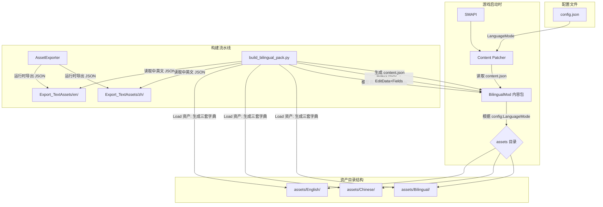
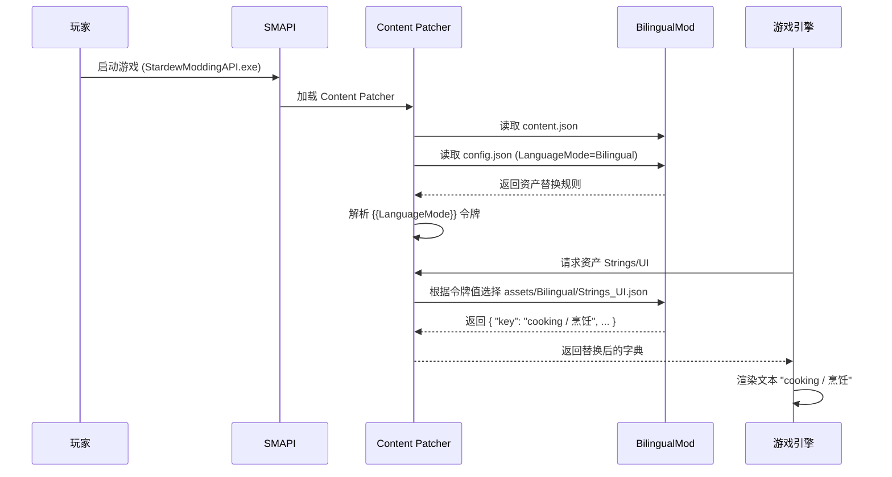

# Stardew Valley Bilingual Text

星露谷物语中英双语同屏显示 Mod。基于 Content Patcher 实现，无需修改游戏代码，支持实时切换显示模式。

## 功能

- **English** — 纯英文模式
- **中文** — 纯中文模式
- **Bilingual** — 双语模式，同时显示 `英文 / 中文`（字符串资产）或 `英文 | 中文`（管道分隔资产）

通过 Generic Mod Config Menu (GMCM) 实时切换，立即生效。

## 前置要求

- [SMAPI](https://smapi.io/) 4.0+
- [Content Patcher](https://www.nexusmods.com/stardewvalley/mods/1915) 2.0+
- [Generic Mod Config Menu](https://www.nexusmods.com/stardewvalley/mods/5098)（可选，推荐用于便捷切换）
- Stardew Valley 1.6+（已包含官方中文语言包）
- 游戏 Language 必须设为 **中文**（需要中文字体渲染）

## 安装

1. 确保已安装 SMAPI、Content Patcher
2. 下载本 Mod 的 `BilingualMod` 文件夹，放入 `Stardew Valley/Mods/`
3. 启动游戏（通过 `StardewModdingAPI.exe`）
4. 在标题画面将 **Language** 设为 **中文**
5. 进入主菜单后，左下角 **Mods** 按钮 → `Stardew Valley Bilingual Text` → 选择 `Bilingual` 模式

## 当前覆盖情况

| 类别 | 方法 | 资产数 |
|------|------|--------|
| Strings/* 界面文本 | `Load` 替换字典 | 30 |
| 对话 (Characters/Dialogue/*) | `Load` 替换字典 | 41 |
| 日程文本 (Strings/schedules/*) | `Load` 替换字典 | 30 |
| Data 文本 (ExtraDialogue, mail, TV) | `Load` 替换字典 | 4 |
| 一般物品 (Data/Objects) | `EditData` Fields 显示名+描述 | 807 |
| 工具 (Data/Tools) | `EditData` Fields 显示名+描述 | 37 |
| 武器 (Data/Weapons) | `EditData` Fields 显示名+描述 | 67 |
| 大件可制造 (Data/BigCraftables) | `EditData` Fields 显示名+描述 | 182 |
| 上衣 (Data/Shirts) | `EditData` Fields 显示名+描述 | 303 |
| 裤子 (Data/Pants) | `EditData` Fields 显示名+描述 | 18 |
| 帽子 (Data/hats) | `EditData` Fields 显示名+描述 | 122 |
| 靴子 (Data/Boots) | `EditData` Fields 显示名+描述 | 18 |
| 特殊能力 (Data/Powers) | `EditData` Fields 显示名+描述 | 36 |
| 饰品 (Data/Trinkets) | `EditData` Fields 显示名+描述 | 8 |
| 任务 (Data/Quests) | `EditData` Fields 标题+描述 | 66 |
| 订婚对话 (Data/EngagementDialogue) | `EditData` Fields | 26 |

## 从源码构建

### 1. 导出游戏文本资产

```bash
cd AssetExporter
dotnet build
```

构建后 Mod 自动部署到 `Stardew Valley/Mods/AssetExporter`。复制 `assets-list.txt` 到该目录，启动游戏一次，会在游戏目录生成 `Export_TextAssets/{en,zh}/`。

### 2. 生成双语内容包

```bash
cd BilingualModBuilder
python build_bilingual_pack.py
```

生成的 Content Patcher 包位于 `BilingualModBuilder/BilingualMod/`，复制到 `Stardew Valley/Mods/` 即可使用。

## 项目结构

```
stardew-bilin/
├── AssetExporter/                  # C# SMAPI Mod，用于导出游戏文本资产
│   ├── AssetExporter.csproj
│   ├── manifest.json
│   ├── ModEntry.cs                 # 遍历资产列表，按类型导出 JSON
│   └── assets-list.txt             # 需要导出的资产路径列表
├── BilingualModBuilder/            # Python 合并脚本
│   ├── build_bilingual_pack.py     # 读取中英文 JSON，生成三套资产 + content.json
│   ├── assets-list.txt
│   └── BilingualMod/               # 脚本输出（由 .gitignore 忽略）
├── BilingualMod/                   # Content Patcher 内容包模板
│   ├── manifest.json
│   ├── config.json
│   └── content.json                # 模板（由 Python 脚本覆盖生成）
├── docs/
│   └── tech-doc.md                 # 原始技术方案文档
├── .gitignore
└── README.md
```

## 技术设计

### 架构



### 数据流



### 关键实现细节

| 组件 | 技术 | 说明 |
|------|------|------|
| 资产导出 | C# SMAPI Mod | 利用 `Helper.GameContent.Load<T>` 以中英文分别导出为 JSON |
| 中文加载 | `.zh-CN` 后缀 | 直接用 `assetPath + ".zh-CN"` 加载中文 XNB |
| Token 解析 | Regex 匹配 `[LocalizedText ...:Key]` | 提取 Key 并在对应的 Strings/* 字典中查找译文 |
| 模型型资产 | `EditData` + 命名字段 | 用 `DisplayName`、`Description` 属性路径直接修改 |
| 管道分隔资产 | `EditData` + 数值索引 | 按 `/` 分割字段，替换指定索引的值 |
| `^` 分隔资产 | 不处理 | Content Patcher 不支持自定义分隔符 |
| 资产合并 | Python 3 | 读取中英文 JSON 对，生成 English / Chinese / Bilingual 三套 |
| 动态切换 | Content Patcher ConfigSchema | `{{LanguageMode}}` 令牌根据 config.json 动态选择 |
| GMCM 集成 | Content Patcher 自动 | ConfigSchema 自动暴露给 GMCM，无需额外代码 |

### 踩坑记录

1. **LocalizedContentManager.CurrentLanguageCode 切换无效**  
   尝试通过 `CurrentLanguageCode = LanguageCode.zh` 切换语言来加载中文资产，结果返回乱码数据。  
   **解决**：直接用 `Helper.GameContent.Load<T>(assetPath + ".zh-CN")` 强制加载带语言后缀的 XNB 文件。

2. **Data/ 资产管道分隔符冲突**  
   用 `Load` 替换整个值会破坏管道分隔数据结构。  
   **解决**：区分三类资产：纯文本（Load 替换字典）、模型型（EditData 命名字段）、管道分隔型（EditData 数值索引）。

3. **方括号 `[]` 与游戏 TokenParser 冲突**  
   初始格式 `"English\n[中文]"` 中方括号被 `TokenParser.ParseTag` 当作标签解析。  
   **解决**：去掉方括号，改用 `"English / 中文"`。

4. **中文字体渲染**  
   英文模式下的字体不含中文字形。  
   **解决**：游戏语言设为中文。

5. **管道分隔资产的双语分隔符冲突**  
   `Data/hats`、`Data/Boots` 等使用 `/` 作为字段分隔符，而双语文本也包含 ` / `，导致额外字段。  
   **解决**：管道分隔资产改用 ` | ` 作为双语分隔符。

6. **`^` 分隔符不兼容**  
   `Data/Achievements` 使用 `^` 作为字段分隔符，但 Content Patcher 的 `EditData` + `Fields` 仅支持 `/` 分隔。  
   **状态**：已回退，等待全值替换方案。

7. **模型型资产无独立 `.zh-CN` 文件**  
   `Data/Objects`、`Data/Powers` 等没有独立的 `.zh-CN.xnb` 文件，中文需通过 Token 从 `Strings/*.zh-CN` 解析。  
   **解决**：加载英文数据，用中文 Strings/* 解析 Token。

## 已知问题

### 未修复

1. **对话显示不一致** — 部分对话显示中文、部分英文、部分双语。原因：对话文本中包含 `#`、`^`、`$` 等特殊标记，双语拼接后可能干扰游戏解析器。
2. **性能** — 116 个 Load 补丁导致启动加载时间变长，游戏内偶发卡顿。
3. **成就 (Achievements)** — 使用 `^` 作为分隔符，Content Patcher 无法正确处理，已回退至原始数据。
4. **信件 (Mail)** — 预览中文、正文英文。`[#]` 标题标签双语化可能存在兼容问题。
5. **能力重复文本** — `Data/Powers` 中部分条目（如 DwarvishTranslationGuide）的 Token 指向 `Strings/Objects` 而非 `Strings/1_6_Strings`，token 解析失败导致双语文本重复。
6. **秘密纸条** — `Data/SecretNotes` 格式特殊，导出失败。
7. **字幕 (credits)** — `Strings/credits` 非标准字典格式，导出失败。

### 已知非问题

- **字符串资产中的 ` / ` 分隔符** — 对非管道分隔的纯文本资产（Strings/*、Characters/Dialogue/*、Strings/schedules/*）安全，不影响游戏解析。

## 后续计划（按优先级）

### P0 — 性能优化
- 减少 Content Patcher 补丁数量：合并同目录 Load 补丁
- 移除运行时 AssetExporter（仅用于构建流程）

### P0 — 对话稳定性
- 调查对话文本中 `#`、`^`、`$` 等特殊标记与双语格式的兼容性
- 可能需要针对对话资产使用不同的分隔策略

### P1 — `^` 分隔资产
- 为 Achievements、SecretNotes 等使用 `^` 分隔的资产重建完整值字符串
- 改用 `EditData` + `Entries`（全值替换）而非 `Fields`

### P1 — 多源 Token 解析
- 对 Powers 等混合使用 `Strings/Objects` 和 `Strings/1_6_Strings` token 的资产，从多个 Strings 源尝试解析

### P2 — 性能优化
- 减少 EditData 补丁数量：对于大型字典（Data/Objects 807 条），考虑只补丁必要的字段
- 延迟加载策略

### P3 — 新功能
- 可自定义分隔符（config.json）
- 不同 UI 上下文使用不同格式
- 支持更多语言对
- 自动检测游戏语言并提示
- 社区纹理支持（UI 溢出优化）

## 许可证

MIT
