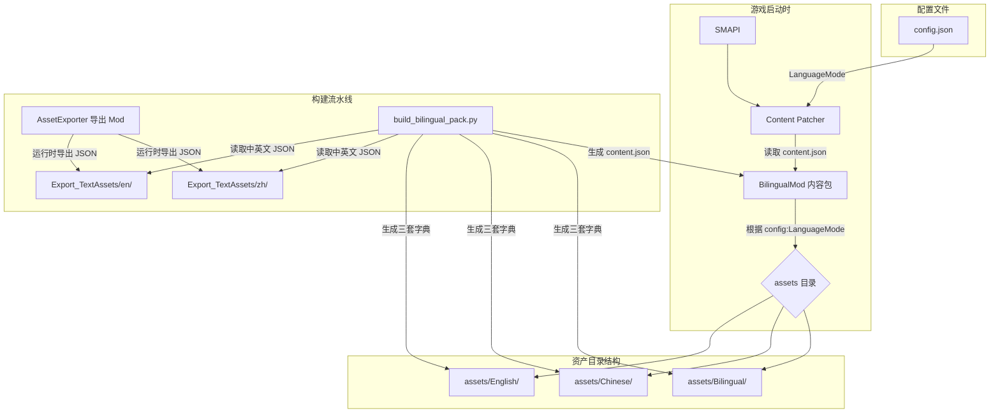
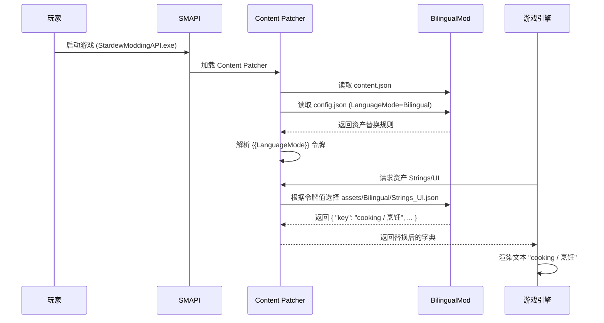

# Stardew Valley Bilingual Text

星露谷物语中英双语同屏显示 Mod。基于 Content Patcher 实现，无需修改游戏代码，支持实时切换显示模式。

## 功能

- **English** — 纯英文模式
- **中文** — 纯中文模式
- **Bilingual** — 双语模式，同时显示 `英文 / 中文`

通过 Generic Mod Config Menu (GMCM) 实时切换，立即生效。

## 前置要求

- [SMAPI](https://smapi.io/) 4.0+
- [Content Patcher](https://www.nexusmods.com/stardewvalley/mods/1915) 2.0+
- [Generic Mod Config Menu](https://www.nexusmods.com/stardewvalley/mods/5098)（可选，推荐用于便捷切换）
- Stardew Valley 1.6+（已包含官方中文语言包）

## 安装

1. 确保已安装 SMAPI、Content Patcher
2. 下载本 Mod 的 `BilingualMod` 文件夹，放入 `Stardew Valley/Mods/`
3. 启动游戏（通过 `StardewModdingAPI.exe`）
4. 在标题画面将 **Language** 设为 **中文**
5. 进入主菜单后，左下角 **Mods** 按钮 → `Stardew Valley Bilingual Text` → 选择 `Bilingual` 模式

## 从源码构建

### 1. 导出游戏文本资产

```bash
cd AssetExporter
dotnet build
```

构建后 Mod 自动部署到 `Stardew Valley/Mods/AssetExporter`。复制 `assets-list.txt` 到该目录，启动游戏一次，会在游戏目录生成 `Export_TextAssets/{en,zh}/`。

### 2. 生成双语内容包

```bash
cd BilingualModBuilder
python build_bilingual_pack.py
```

生成的 Content Patcher 包位于 `BilingualModBuilder/BilingualMod/`，复制到 `Stardew Valley/Mods/` 即可使用。

## 项目结构

```
stardew-bilin/
├── AssetExporter/                  # C# SMAPI Mod，用于导出游戏文本资产
│   ├── AssetExporter.csproj
│   ├── manifest.json
│   ├── ModEntry.cs                 # 遍历资产列表，以 Dictionary<string,string> 导出
│   └── assets-list.txt             # 需要导出的资产路径列表
├── BilingualModBuilder/            # Python 合并脚本
│   ├── build_bilingual_pack.py     # 读取中英文 JSON，生成三套资产 + content.json
│   ├── assets-list.txt
│   └── BilingualMod/               # 脚本输出（由 .gitignore 忽略）
├── BilingualMod/                   # Content Patcher 内容包模板
│   ├── manifest.json
│   ├── config.json
│   └── content.json                # 模板（由 Python 脚本覆盖生成）
├── docs/
│   └── tech-doc.md                 # 原始技术方案文档
├── .gitignore
└── README.md
```

## 技术设计

### 架构



### 数据流



### 关键实现细节

| 组件 | 技术 | 说明 |
|------|------|------|
| 资产导出 | C# SMAPI Mod | 利用 `Helper.GameContent.Load` 以中英文分别导出 `Dictionary<string,string>` 为 JSON |
| 中文加载 | `.zh-CN` 后缀 | 直接用 `assetPath + ".zh-CN"` 加载中文 XNB，不依赖切换游戏语言代码 |
| 资产合并 | Python 3 | 读取中英文 JSON 对，生成 English / Chinese / Bilingual 三套 JSON |
| 动态切换 | Content Patcher ConfigSchema | `{{LanguageMode}}` 令牌根据 config.json 动态选择资产目录 |
| GMCM 集成 | Content Patcher 自动 | ConfigSchema 自动暴露给 GMCM，无需额外代码 |

### 踩坑记录

1. **LocalizedContentManager.CurrentLanguageCode 切换无效**  
   尝试通过 `CurrentLanguageCode = LanguageCode.zh` 切换语言来加载中文资产，结果返回乱码数据。  
   **解决**：直接用 `Helper.GameContent.Load<Dictionary<string, string>>(assetPath + ".zh-CN")` 强制加载带语言后缀的 XNB 文件。

2. **Data/ 资产管道分隔符冲突**  
   `Data/Objects`、`Data/hats` 等资产的值是用 `/` 或 `|` 分隔的结构化数据（如 `"物品名/价格/描述/..."`），直接用双语格式 `"English\n[中文]"` 替换整个值会破坏数据结构，导致 `IndexOutOfRangeException`。  
   **解决**：仅对 `Strings/*` 和 `Characters/Dialogue/*` 等纯文本资产应用双语替换，`Data/*` 资产排除在外。

3. **方括号 `[]` 与游戏 TokenParser 冲突**  
   初始格式 `"English\n[中文]"` 中方括号被游戏 `TokenParser.ParseTag` 当作标签标记解析，导致 `CraftingRecipe` 初始化时崩溃。  
   **解决**：去掉方括号，改为 `"English\n中文"` 或 `"English / 中文"`。

4. **中文字体渲染**  
   游戏英文模式下加载的 `SmallFont.xnb` / `SpriteFont1.xnb` 不含中文字形，直接替换文本无法显示中文。  
   尝试用 Content Patcher 的 Load 替换字体 XNB，但 SpriteFont 类型依赖额外的纹理图集文件，不可行。  
   **解决**：游戏语言设为中文，利用中文模式自带的中文字体（同时包含中英文字形），Mod 只替换文本内容。

5. **内容包 manifest.json 缺失**  
   Content Patcher 要求每个内容包根目录有 `manifest.json`，否则 SMAPI 静默跳过该包。  
   **解决**：Python 脚本自动复制 `manifest.json` 到输出目录。

## TODO

- [ ] 支持 `Data/Objects`、`Data/Tools` 等结构化资产的描��字段双语化（使用 Content Patcher `EditData` + `Fields`）
- [ ] 可自定义分隔符（config.json 中增加 SeparatorStyle 选项）
- [ ] 支持更多语言对（如日英、韩英等）
- [ ] 自动检测游戏语言并提示
- [ ] 更优雅的 UI 溢出处理（不同 UI 上下文使用不同格式）
- [ ] 处理非 `Dictionary<string,string>` 类型的资产（如 `Dictionary<int,string>`）

## 许可证

MIT
